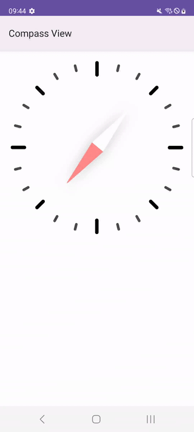

# CompassView

[](https://central.sonatype.com/artifact/net.kibotu/CompassView) [](https://jitpack.io/#kibotu/CompassView) [](https://github.com/kibotu/CompassView/actions/workflows/android.yml) [](https://android-arsenal.com/api?level=23) [](https://android-arsenal.com/api?level=36) [](https://kotlinlang.org/) [](https://gradle.org/)

Customizable compass widget for Android with View and Jetpack Compose support.



## Features

- 🧭 Sensor-driven compass rotation with smooth animations
- 🎨 Fully customizable colors, degree markers, and orientation labels
- 🎯 Custom needle drawable support
- 📐 Configurable degree steps and border
- 📱 View-based (XML) and Compose implementations
- ⚡ Lightweight with no external dependencies (except Compose for the Compose module)
- 🔄 Lifecycle-aware sensor management

## Installation

### Maven Central

For View-based (XML) compass:

```kotlin
dependencies {
    implementation("net.kibotu:CompassView:latest-version")
}
```

For Jetpack Compose compass:

```kotlin
dependencies {
    implementation("net.kibotu:CompassView-Compose:latest-version")
}
```

### JitPack

Add the JitPack repository:

```kotlin
dependencyResolutionManagement {
    repositories {
        maven { url = uri("https://jitpack.io") }
    }
}
```

Then add the dependency:

```kotlin
dependencies {
    // View-based
    implementation("com.github.kibotu:CompassView:latest-version")
    
    // Compose
    implementation("com.github.kibotu:CompassView:latest-version") {
        artifact {
            name = "compass-compose"
        }
    }
}
```

## Quick Start

### View (XML)

Add the compass to your layout:

```xml
<net.kibotu.compassview.Compass
    android:id="@+id/compass"
    android:layout_width="200dp"
    android:layout_height="200dp"
    app:degree_color="@color/blue"
    app:degrees_step="15"
    app:needle="@drawable/ic_needle"
    app:orientation_labels_color="@color/red"
    app:show_orientation_labels="true"
    app:show_degree_value="true"
    app:show_border="false"
    app:degree_value_color="@color/black"
    app:border_color="@color/red" />
```

Listen to sensor events in Kotlin:

```kotlin
val compass = findViewById<Compass>(R.id.compass)
compass.setListener(object : CompassListener {
    override fun onSensorChanged(event: SensorEvent) {
        Log.d("Compass", "Degree: ${event.values[0]}")
    }

    override fun onAccuracyChanged(sensor: Sensor, accuracy: Int) {
        Log.d("Compass", "Accuracy: $accuracy")
    }
})
```

### Compose

Use the `Compass` composable:

```kotlin
import net.kibotu.compassview.compose.Compass
import net.kibotu.compassview.compose.rememberCompassState

@Composable
fun MyScreen() {
    val compassState = rememberCompassState(
        onSensorChanged = { event ->
            Log.d("Compass", "Degree: ${event.values[0]}")
        }
    )
    
    Compass(
        state = compassState,
        modifier = Modifier.size(200.dp),
        degreeColor = Color.Blue,
        degreesStep = 15,
        showOrientationLabels = true,
        orientationLabelsColor = Color.Red,
        showDegreeValue = true,
        degreeValueColor = Color.Black,
        showBorder = false,
        borderColor = Color.Red
    )
}
```

## Customization

### View (XML) Attributes

| Attribute | Type | Description | Default |
|-----------|------|-------------|---------|
| `degree_color` | color | Color of compass degree lines | Black |
| `degrees_step` | integer | Step between degree markers (must divide 360) | 15 |
| `needle` | drawable | Custom needle drawable | Default red/white needle |
| `show_orientation_labels` | boolean | Show N, E, S, W labels | false |
| `orientation_labels_color` | color | Color of orientation labels | Black |
| `show_degree_value` | boolean | Show current degree value as text | false |
| `degree_value_color` | color | Color of degree value text | Black |
| `show_border` | boolean | Show outer circle border | false |
| `border_color` | color | Color of border circle | Black |

### Compose Parameters

| Parameter | Type | Description | Default |
|-----------|------|-------------|---------|
| `modifier` | Modifier | Modifier for the compass | `Modifier` |
| `state` | CompassState | State holder for sensor data | `rememberCompassState()` |
| `degreeColor` | Color | Color of compass degree lines | `Color.Black` |
| `degreesStep` | Int | Step between degree markers | `15` |
| `needle` | Painter? | Custom needle painter | Default needle |
| `showOrientationLabels` | Boolean | Show N, E, S, W labels | `false` |
| `orientationLabelsColor` | Color | Color of orientation labels | `Color.Black` |
| `showDegreeValue` | Boolean | Show current degree value | `false` |
| `degreeValueColor` | Color | Color of degree value text | `Color.Black` |
| `showBorder` | Boolean | Show outer circle border | `false` |
| `borderColor` | Color | Color of border circle | `Color.Black` |
| `onSensorChanged` | ((SensorEvent) -> Unit)? | Sensor change callback | `null` |
| `onAccuracyChanged` | ((Sensor, Int) -> Unit)? | Accuracy change callback | `null` |

## API Reference

### View

**Compass** - Custom View that displays a compass

Methods:
- `setListener(listener: CompassListener?)` - Set sensor event listener

**CompassListener** - Interface for sensor callbacks

```kotlin
interface CompassListener {
    fun onSensorChanged(event: SensorEvent)
    fun onAccuracyChanged(sensor: Sensor, accuracy: Int)
}
```

### Compose

**Compass** - Composable function that displays a compass

**rememberCompassState** - Creates and remembers a `CompassState` with lifecycle-aware sensor management

**CompassState** - State holder for compass data

Properties:
- `currentDegree: Float` - Current rotation degree
- `direction: String` - Current direction (e.g., "45.0° NE")

## Architecture

- **View**: Custom `RelativeLayout` with sensor-driven rotation using `RotateAnimation`
- **Compose**: Composable using `Canvas` for drawing and `animateFloatAsState` for smooth rotation
- Both implementations use Android's `SensorManager` with `TYPE_ORIENTATION` sensor
- Lifecycle-aware sensor registration/unregistration

## Permissions

No special permissions required. The compass uses the device's orientation sensor, which is available by default. If the sensor is not available, the compass will not rotate.

## Requirements

- minSdk: 23 (Android 6.0)
- targetSdk: 36 (Android 15)
- Kotlin: 2.3.10
- Gradle: 9.4.0

## License

```
Copyright 2018 Belkilani Ahmed Radhouane, Jan Rabe 2025

Licensed under the Apache License, Version 2.0 (the "License");
you may not use this file except in compliance with the License.
You may obtain a copy of the License at

   http://www.apache.org/licenses/LICENSE-2.0

Unless required by applicable law or agreed to in writing, software
distributed under the License is distributed on an "AS IS" BASIS,
WITHOUT WARRANTIES OR CONDITIONS OF ANY KIND, either express or implied.
See the License for the specific language governing permissions and
limitations under the License.
```
